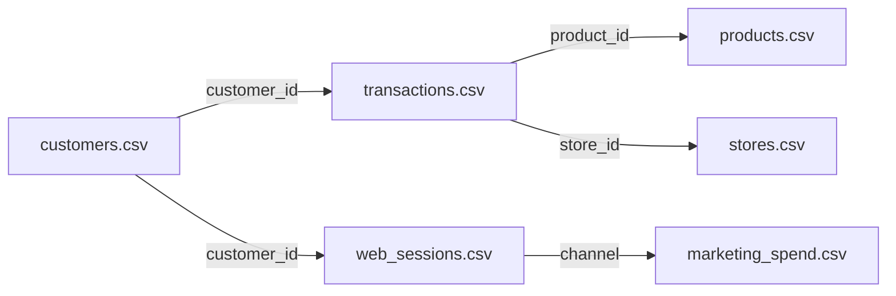
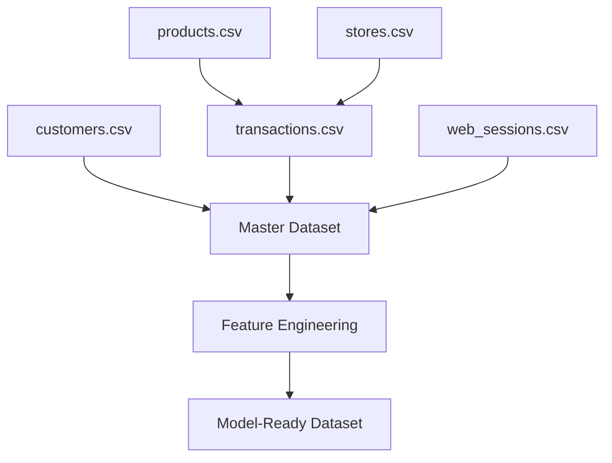
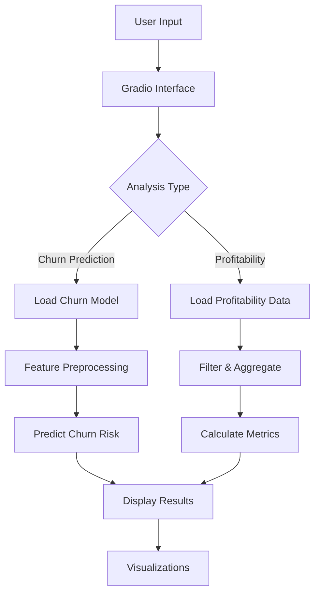

# Customer Churn & Category Profitability Analysis - Project Plan

## Executive Summary

This project aims to build a comprehensive analytics solution that:
1. **Predicts customer churn risk** using machine learning classification
2. **Analyzes product category profitability** accounting for costs and discounts
3. **Delivers insights via an interactive Gradio application**

## Data Overview

### Available Datasets

| Dataset | Records | Key Fields | Purpose |
|---------|---------|------------|---------|
| **customers.csv** | ~18,000 | customer_id, signup_date, age_band, island, loyalty_tier, churn_flag | Customer demographics and churn labels |
| **transactions.csv** | ~250,000 | txn_id, date, customer_id, product_id, qty, unit_price, unit_cost, discount_pct, payment_method | Purchase history and revenue data |
| **products.csv** | ~1,200 | product_id, category, subcategory, supplier_id, unit_price, unit_cost, launch_date | Product catalog and cost structure |
| **web_sessions.csv** | ~100,000 | session_id, date, customer_id, channel, pages_viewed, cart_abandoned | Digital engagement metrics |
| **stores.csv** | 12 | store_id, island, sqft, opening_date, manager_tenure_months | Store characteristics |
| **marketing_spend.csv** | ~500 | month, channel, campaign, spend_usd | Marketing investment data |

### Data Relationships



## Phase 1: Data Exploration & Profiling

### Objectives
- Understand data quality and completeness
- Identify missing values and outliers
- Analyze distributions and relationships
- Validate data consistency across tables

### Key Analyses
1. **Data Quality Assessment**
   - Missing value analysis per column
   - Duplicate record detection
   - Data type validation
   - Date range consistency

2. **Descriptive Statistics**
   - Customer demographics distribution
   - Transaction patterns over time
   - Product category mix
   - Churn rate by segment

3. **Relationship Validation**
   - Foreign key integrity checks
   - Customer-transaction linkage
   - Product-transaction linkage
   - Temporal consistency

### Deliverables
- Data quality report
- Exploratory data analysis notebook
- Initial insights document

## Phase 2: Data Preparation & Cleaning

### Data Integration Strategy



### Cleaning Decisions Documentation

All data cleaning decisions will be documented in `data_cleaning_log.md` including:
- **Missing Value Treatment**: Imputation strategy per column
- **Outlier Handling**: Detection method and treatment approach
- **Data Type Conversions**: Standardization of formats
- **Feature Transformations**: Encoding and scaling decisions
- **Date Handling**: Reference date selection and recency calculations

### Key Transformations

1. **Customer-Level Aggregations**
   - Total transactions count
   - Total revenue (gross and net)
   - Average order value
   - Days since last purchase (recency)
   - Purchase frequency
   - Customer lifetime value

2. **Behavioral Features**
   - Web session metrics (total sessions, avg pages viewed, cart abandonment rate)
   - Channel preference
   - Payment method preference
   - Discount sensitivity

3. **Temporal Features**
   - Customer tenure (days since signup)
   - Seasonality indicators
   - Trend features (increasing/decreasing activity)

### Deliverables
- Cleaned datasets in `Data/processed/`
- `data_cleaning_log.md` with all decisions documented
- Feature engineering notebook

## Phase 3: Churn Prediction Model

### Model Selection Criteria

**Candidate Algorithms:**
1. **Logistic Regression** - Baseline, interpretable
2. **Random Forest** - Handles non-linearity, feature importance
3. **XGBoost** - High performance, handles imbalanced data
4. **LightGBM** - Fast training, efficient with large datasets

**Selection Approach:** Compare all models and select based on:
- ROC-AUC score (primary metric)
- F1-score (balance precision/recall)
- Training time
- Interpretability needs

### Feature Engineering for Churn

**RFM Analysis:**
- **Recency**: Days since last purchase
- **Frequency**: Number of transactions
- **Monetary**: Total spend

**Engagement Metrics:**
- Web session frequency
- Pages viewed per session
- Cart abandonment rate
- Channel diversity

**Customer Profile:**
- Age band (encoded)
- Island location (encoded)
- Loyalty tier (ordinal encoding)
- Tenure (days since signup)

**Behavioral Indicators:**
- Declining purchase trend
- Discount dependency ratio
- Payment method changes
- Category concentration

### Model Development Process


### Evaluation Metrics

**Required Metrics:**
- **Precision**: Of predicted churners, how many actually churned
- **Recall**: Of actual churners, how many we identified
- **F1-Score**: Harmonic mean of precision and recall
- **ROC-AUC**: Overall model discrimination ability

**Additional Metrics:**
- Confusion matrix
- Precision-recall curve
- Feature importance rankings
- SHAP values for interpretability

### Deliverables
- Trained model saved as `models/churn_model.pkl`
- Model evaluation report with all metrics
- Feature importance analysis
- Model training notebook

## Phase 4: Category Profitability Analysis

### Profitability Metrics

**Core Calculations:**

1. **Gross Profit Margin**
   ```
   Gross Profit = (unit_price - unit_cost) × qty
   Gross Margin % = (Gross Profit / Revenue) × 100
   ```

2. **Net Profit After Discounts**
   ```
   Net Revenue = gross_amount × (1 - discount_pct/100)
   Net Profit = Net Revenue - (unit_cost × qty)
   Net Margin % = (Net Profit / Net Revenue) × 100
   ```

3. **Discount Impact**
   ```
   Discount Cost = gross_amount × (discount_pct/100)
   Discount Rate = Avg(discount_pct) by category
   ```

### Analysis Dimensions

**Category-Level Analysis:**
- Profitability by main category (Electronics subcategories)
- Profitability by subcategory (TV & Video, Audio, Mobile, Computing, Accessories)
- Trend analysis over time
- Seasonal patterns

**Profitability Drivers:**
- Product mix impact
- Discount strategy effectiveness
- Cost structure analysis
- Volume vs. margin trade-offs

**Risk Identification:**
- Categories with declining margins
- High-discount dependency categories
- Low-volume, low-margin products
- Supplier cost pressure indicators

### Deliverables
- Category profitability dashboard data
- Profitability trends report
- Risk category identification
- Profitability analysis notebook

## Phase 5: Gradio Application Development

### Application Architecture



### Interface Design

**Tab 1: Customer Churn Prediction**

*Input Fields:*
- Customer tenure (days)
- Total transactions
- Days since last purchase
- Average order value
- Web sessions count
- Cart abandonment rate
- Loyalty tier (dropdown)
- Age band (dropdown)
- Island (dropdown)

*Output:*
- Churn probability (0-100%)
- Risk level (Low/Medium/High)
- Key risk factors
- Recommended actions

**Tab 2: Category Profitability Insights**

*Input Fields:*
- Category selection (dropdown)
- Time period (date range)
- Minimum transaction threshold

*Output:*
- Current profit margin
- Trend indicator (gaining/losing)
- Comparison to other categories
- Discount impact analysis
- Volume metrics
- Recommendations

**Tab 3: Batch Analysis**

*Input:*
- Upload CSV with customer data

*Output:*
- Downloadable results with churn scores
- Summary statistics
- Risk distribution chart

### Technical Implementation

**Key Components:**
1. **Model Loading**: Pickle/joblib for trained model
2. **Data Processing**: Pandas for feature engineering
3. **Visualization**: Plotly for interactive charts
4. **Interface**: Gradio blocks for custom layout
5. **Validation**: Input validation and error handling

### Deliverables
- `app.py` - Main Gradio application
- `requirements.txt` - Python dependencies
- `README.md` - Application usage guide
- Deployment instructions

## Phase 6: Documentation & Reporting

### Documentation Structure

1. **Technical Documentation**
   - `README.md` - Project overview and setup
   - `data_cleaning_log.md` - All cleaning decisions
   - `model_documentation.md` - Model details and performance
   - `API_documentation.md` - Gradio app usage

2. **Analysis Reports**
   - `churn_analysis_report.md` - Churn insights and findings
   - `profitability_report.md` - Category profitability analysis
   - `recommendations.md` - Business recommendations

3. **Notebooks**
   - `01_data_exploration.ipynb`
   - `02_data_preparation.ipynb`
   - `03_churn_modeling.ipynb`
   - `04_profitability_analysis.ipynb`

### Key Deliverables

**Model Performance Report:**
- Confusion matrix
- ROC curve
- Precision-recall curve
- Feature importance plot
- Model comparison table

**Profitability Report:**
- Category ranking by margin
- Trend analysis charts
- Risk categories identified
- Discount effectiveness analysis

**Business Recommendations:**
- High-risk customer segments
- Retention strategies
- Category optimization opportunities
- Pricing and discount recommendations

## Project Structure

```
CustomerAndCategoryDeepDive/
├── Data/
│   ├── customers.csv
│   ├── transactions.csv
│   ├── products.csv
│   ├── web_sessions.csv
│   ├── stores.csv
│   ├── marketing_spend.csv
│   └── processed/
│       ├── master_dataset.csv
│       └── model_features.csv
├── notebooks/
│   ├── 01_data_exploration.ipynb
│   ├── 02_data_preparation.ipynb
│   ├── 03_churn_modeling.ipynb
│   └── 04_profitability_analysis.ipynb
├── models/
│   ├── churn_model.pkl
│   └── feature_scaler.pkl
├── src/
│   ├── data_processing.py
│   ├── feature_engineering.py
│   ├── model_training.py
│   └── profitability_analysis.py
├── app.py
├── requirements.txt
├── PROJECT_PLAN.md
├── data_cleaning_log.md
├── model_documentation.md
├── churn_analysis_report.md
├── profitability_report.md
└── README.md
```

## Technology Stack

**Core Libraries:**
- `pandas` - Data manipulation
- `numpy` - Numerical operations
- `scikit-learn` - Machine learning models and metrics
- `xgboost` or `lightgbm` - Gradient boosting
- `imbalanced-learn` - Handling class imbalance

**Visualization:**
- `matplotlib` - Static plots
- `seaborn` - Statistical visualizations
- `plotly` - Interactive charts

**Application:**
- `gradio` - Web interface
- `joblib` - Model serialization

**Development:**
- `jupyter` - Notebook environment
- `pytest` - Testing (optional)

## Success Criteria

### Model Performance Targets
- ROC-AUC ≥ 0.75
- F1-Score ≥ 0.65
- Precision ≥ 0.70 (minimize false positives)
- Recall ≥ 0.60 (catch majority of churners)

### Analysis Quality
- All data cleaning decisions documented
- Profitability analysis covers all categories
- Clear identification of at-risk categories
- Actionable business recommendations

### Application Usability
- Intuitive interface requiring no technical knowledge
- Response time < 2 seconds for predictions
- Clear visualizations and explanations
- Error handling for invalid inputs

## Timeline Estimate

| Phase | Duration | Dependencies |
|-------|----------|--------------|
| Data Exploration | 1-2 days | None |
| Data Preparation | 2-3 days | Phase 1 |
| Churn Modeling | 3-4 days | Phase 2 |
| Profitability Analysis | 2-3 days | Phase 2 |
| Gradio App Development | 2-3 days | Phases 3 & 4 |
| Documentation | 1-2 days | All phases |
| **Total** | **11-17 days** | - |

## Risk Mitigation

**Potential Risks:**
1. **Class Imbalance**: Use SMOTE, class weights, or stratified sampling
2. **Data Quality Issues**: Comprehensive cleaning and validation
3. **Model Overfitting**: Cross-validation and regularization
4. **Feature Leakage**: Careful temporal validation
5. **Deployment Issues**: Test locally before deployment

## Next Steps

Once this plan is approved, we will:
1. Begin with data exploration and profiling
2. Document all findings and decisions
3. Proceed iteratively through each phase
4. Maintain clear communication of progress
5. Deliver a production-ready solution

---

**Note**: This plan is flexible and may be adjusted based on findings during the exploration phase or specific requirements that emerge during development.