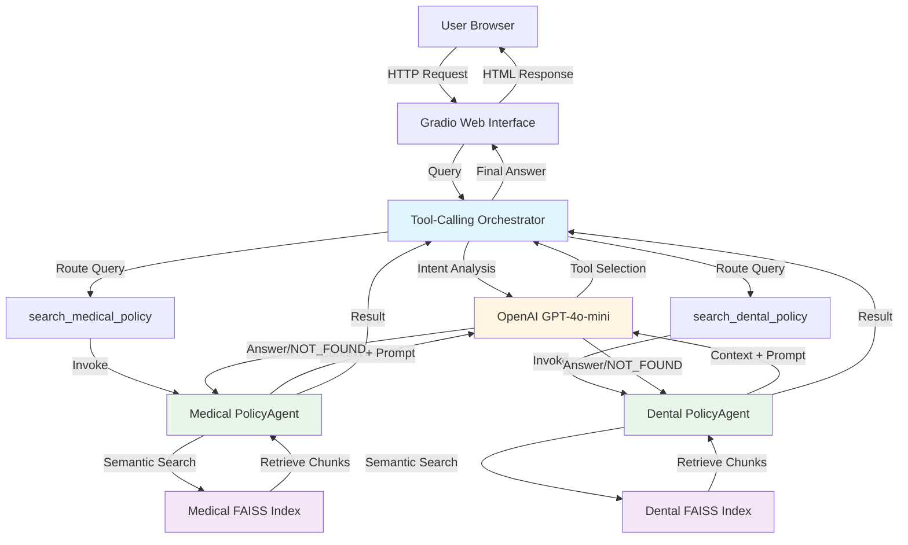
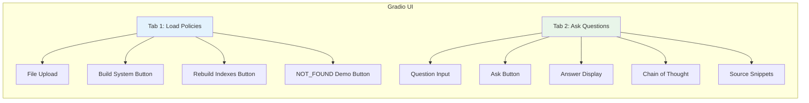
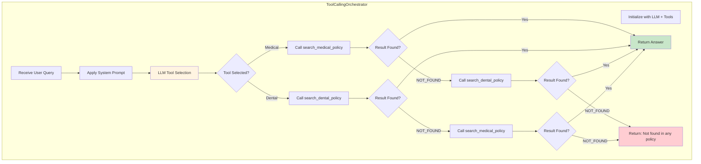
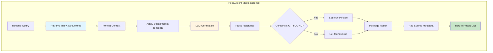
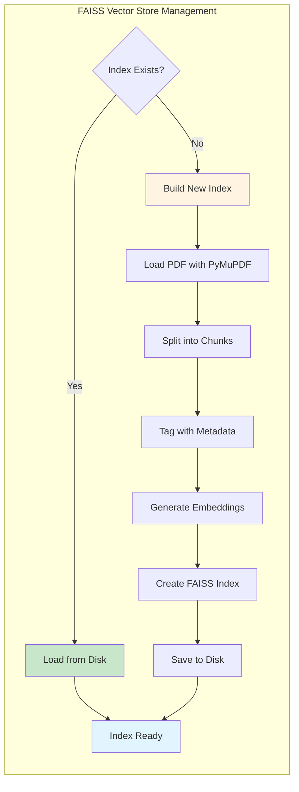
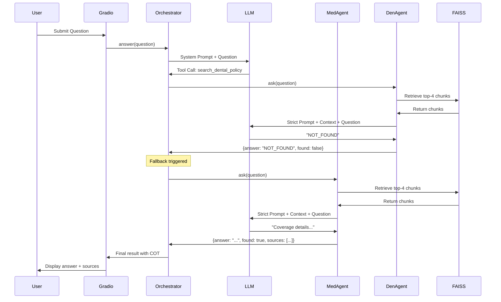
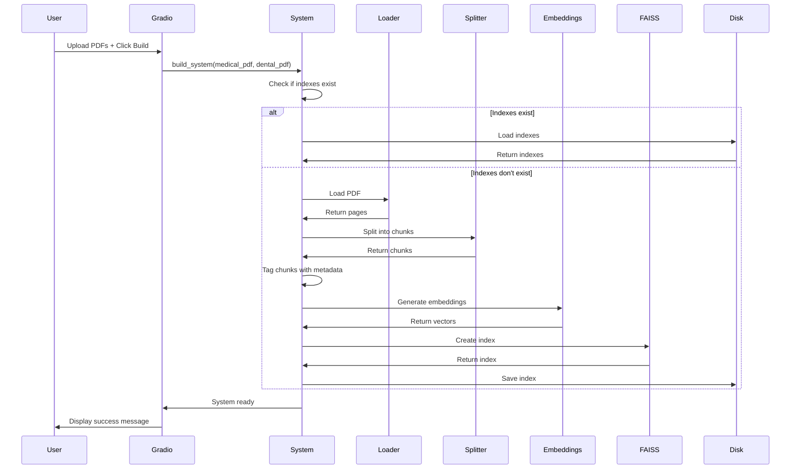
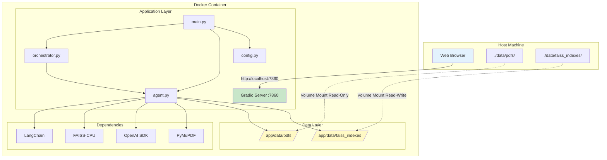

# Multi-Policy RAG Application - Architecture Documentation

## System Architecture Overview

This document provides detailed architectural diagrams and explanations for the Multi-Policy RAG (Retrieval-Augmented Generation) application.

## High-Level Architecture



## Component Architecture

### 1. Gradio Web Interface Layer



**Responsibilities:**
- User interaction and input collection
- File upload handling
- Result visualization
- Chain-of-thought display
- Source attribution presentation

### 2. Orchestrator Layer



**Key Features:**
- Intent-based routing using LLM tool calling
- Automatic fallback mechanism
- Chain-of-thought tracking
- Source policy attribution
- Max iteration safety net

### 3. PolicyAgent Layer



**Strict Prompt Contract:**
```
RULES:
1. If context contains answer → provide factual answer + quote
2. If context lacks information → return exactly "NOT_FOUND"
3. Never use outside knowledge
4. Never guess
```

### 4. Vector Store Layer



**Chunking Strategy:**
- Chunk size: 800 characters
- Overlap: 100 characters
- Separators: `\n\n`, `\n`, `. `, ` `, ``
- Metadata: policy label, source file, page number

## Data Flow Diagrams

### Query Processing Flow



### Index Building Flow



## Docker Deployment Architecture



## Technology Stack

### Core Technologies

| Component | Technology | Version | Purpose |
|-----------|-----------|---------|---------|
| Language | Python | 3.11+ | Application runtime |
| LLM | OpenAI GPT-4o-mini | Latest | Query routing & generation |
| Embeddings | text-embedding-3-small | Latest | Document vectorization |
| Vector Store | FAISS | 1.7.4+ | Semantic search |
| Web Framework | Gradio | 4.0+ | User interface |
| PDF Processing | PyMuPDF | 1.23+ | Document loading |
| Orchestration | LangChain | 0.1+ | RAG pipeline |
| Containerization | Docker | 20.10+ | Deployment |

### Python Dependencies

```
langchain>=0.1.0
langchain-core>=0.1.0
langchain-openai>=0.0.5
langchain-community>=0.0.20
langchain-text-splitters>=0.0.1
faiss-cpu>=1.7.4
openai>=1.0.0
gradio>=4.0.0
python-dotenv>=1.0.0
PyMuPDF>=1.23.0
tiktoken>=0.5.0
```

## Security Considerations

### API Key Management
- API keys stored in environment variables
- Never committed to version control
- `.env.example` provided as template
- Docker secrets support (optional)

### Volume Permissions
- PDF directory: Read-only mount
- Index directory: Read-write with proper permissions
- No sensitive data in logs

### Network Security
- Container exposes only port 7860
- No external network access required (except OpenAI API)
- Can run behind reverse proxy

## Performance Characteristics

### Embedding Performance
- **First Run**: 30-60 seconds per PDF (embedding time)
- **Subsequent Runs**: 2-5 seconds (load from disk)
- **Memory Usage**: ~500MB-1GB depending on document size

### Query Performance
- **Retrieval**: 50-100ms (FAISS search)
- **LLM Generation**: 1-3 seconds (OpenAI API)
- **Total Response Time**: 2-5 seconds typical

### Scalability
- **Documents**: Tested with 2 policies, scales to 10+
- **Concurrent Users**: 5-10 (Gradio limitation)
- **Index Size**: ~10-50MB per policy

## Monitoring and Observability

### Logging Strategy
```python
# Application logs
- INFO: System initialization
- INFO: Index loading/building
- INFO: Query processing
- DEBUG: Tool calls and responses
- ERROR: Failures and exceptions

# Chain of Thought
- Captured in UI for each query
- Shows decision-making process
- Useful for debugging routing
```

### Health Checks
- Container health: Gradio server responsive
- Index health: Files exist and loadable
- API health: OpenAI connectivity

## Future Enhancements

### Potential Improvements
1. **Multi-tenancy**: Support multiple policy sets
2. **Authentication**: User login and access control
3. **Analytics**: Query logging and analysis
4. **Caching**: Response caching for common queries
5. **Streaming**: Real-time response streaming
6. **API Mode**: REST API alongside web UI
7. **Advanced Retrieval**: Hybrid search, reranking
8. **Model Selection**: Support multiple LLM providers

---

**Document Version**: 1.0  
**Last Updated**: 2026-05-30  
**Status**: Planning Phase